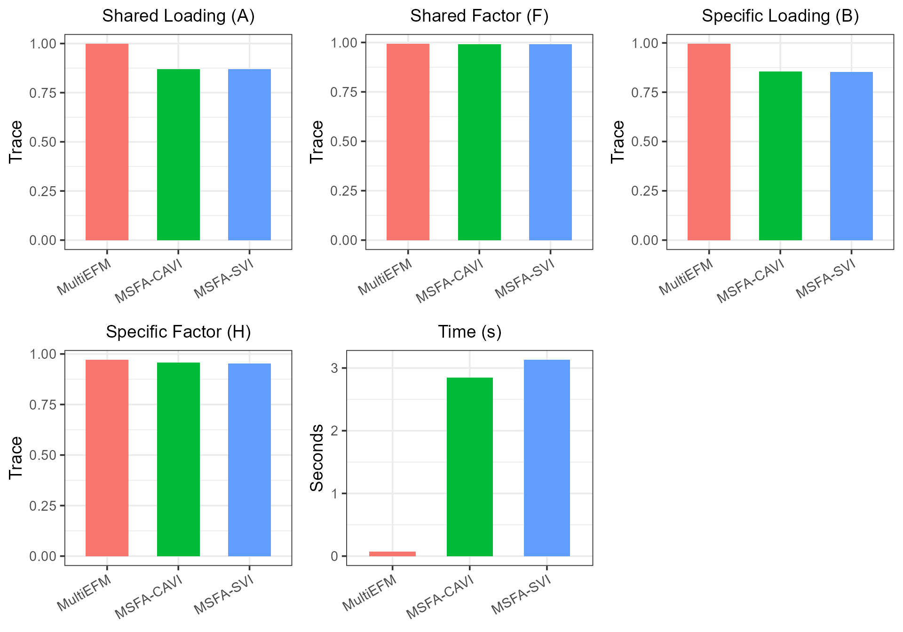

# Low Dimensional Example of MultiEFM

This vignette introduces the usage of MultiEFM for the analysis of
low-dimensional multi-study multivariate data with heavy tail, by
comparison with other methods.

The package can be loaded with the command, and define some metric
functions:

``` r
library(MultiEFM)
library(VIMSFA)
library(irlba)   
library(ggplot2)
library(cowplot) 
trace_statistic_fun <- function(H, H0){
  tr_fun <- function(x) sum(diag(x))
  mat1 <- t(H0) %*% H %*% qr.solve(t(H) %*% H) %*% t(H) %*% H0
  tr_fun(mat1) / tr_fun(t(H0) %*% H0)
}
trace_list_fun <- function(Hlist, H0list){
  trvec <- sapply(seq_along(Hlist), function(i) trace_statistic_fun(Hlist[[i]], H0list[[i]]))
  return(mean(trvec, na.rm = TRUE))
}
```

## Generate simulated data

First, we generate the simulated data with heavy tail, where the error
term follows from a multivariate t-distribution with degree of freedom
2.

``` r
set.seed(1)
nu <- 2 # nu is set to
p <- 100
nvec <- c(150,200);  q <- 3; qs <- c(2,2); S <- length(nvec)
sigma2_eps <- 1
datList <- gendata_simu_robust(seed=1, nvec=nvec, p=p, q=q, qs=qs, rho=c(5,5), err.type='mvt', nu=nu)
XList <- datList$Xlist
```

## Fit the MultiEFM model

Fit the MultiEFM model using the function ‘MultiEFM()’ in the R package
‘MultiEFM’. Users can use ‘?MultiEFM’ to see the details about this
function. For two matrices $`\widehat D`$ and $`D`$, we use trace
statistic to measure their similarity. The trace statistic ranges from 0
to 1, with higher values indicating better performance.

``` r
methodNames <- c("MultiEFM", "MSFA-CAVI", "MSFA-SVI")
metricMat <- matrix(NA, nrow=length(methodNames), ncol=5)
colnames(metricMat) <- c('A_tr', 'B_tr',  'F_tr', 'H_tr', 'Time')
row.names(metricMat) <- methodNames

tic <- proc.time()
res <- MultiEFM(XList, q=q, qs_vec=qs)
#> Iter 1: Obj = 17839.286728, rel change = 1.794e+02
#> Iter 2: Obj = 17839.286728, rel change = 0.000e+00
toc <- proc.time()

metricMat["MultiEFM",'Time'] <- toc[3] - tic[3]
metricMat["MultiEFM",'A_tr'] <- trace_statistic_fun(res$A, datList$A0)
metricMat["MultiEFM",'B_tr'] <- trace_list_fun(res$B, datList$Blist0)
metricMat["MultiEFM",'F_tr'] <- trace_list_fun(res$F, datList$Flist)
metricMat["MultiEFM",'H_tr'] <- trace_list_fun(res$H, datList$Hlist)
```

## Compare with other methods

We compare MultiEFM with two prominent methods: MSFA-CAVI and MSFA-SVI

First, we implement MSFA-CAVI:

``` r
X_s <- lapply(XList, scale, scale=FALSE)
### MSFA-CAVI
print("MSFA-CAVI")
#> [1] "MSFA-CAVI"
tic <- proc.time()
cavi_est <- cavi_msfa(X_s,  K=q, J_s=qs)
#> [1] "Iteration:    1, Objective: 3.13498e+03, Relative improvement Inf"
#> [1] "Iteration:    1, Objective: 2.49489e+02, Relative improvement Inf"
#> [1] "Iteration:    1, Objective: 6.66755e+02, Relative improvement Inf"
#> [1] "Algorithm converged in 5 iterations."
toc <- proc.time()
time_cavi <- toc[3] - tic[3]

hF_cavi <- hH_cavi <- list()
for(s in 1:S){
  hF_cavi[[s]] <- t(Reduce(cbind, cavi_est$mean_f[[s]]))
  hH_cavi[[s]] <- t(Reduce(cbind, cavi_est$mean_l[[s]]))
}

metricMat["MSFA-CAVI",'Time']  <- time_cavi
metricMat["MSFA-CAVI",'A_tr']  <- trace_statistic_fun(cavi_est$mean_phi, datList$A0)
metricMat["MSFA-CAVI",'B_tr']  <- trace_list_fun(cavi_est$mean_lambda_s, datList$Blist0)
metricMat["MSFA-CAVI",'F_tr'] <- trace_list_fun(hF_cavi, datList$Flist)
metricMat["MSFA-CAVI",'H_tr'] <- trace_list_fun(hH_cavi, datList$Hlist)
```

``` r
print("MSFA-SVI")
#> [1] "MSFA-SVI"
tic <- proc.time()
svi_est <- svi_msfa(X_s, K=q, J_s=qs, verbose = 0)
#> [1] "Iteration:    1, Objective: 3.12968e+03, Relative improvement Inf"
#> [1] "Iteration:    1, Objective: 2.48149e+02, Relative improvement Inf"
#> [1] "Iteration:    1, Objective: 6.66373e+02, Relative improvement Inf"
#> [1] "iteration 1 finished"
#> [1] "iteration 2 finished"
#> [1] "iteration 3 finished"
#> [1] "iteration 4 finished"
#> [1] "iteration 5 finished"
#> [1] "iteration 6 finished"
#> [1] "iteration 7 finished"
#> [1] "iteration 8 finished"
#> [1] "iteration 9 finished"
#> [1] "iteration 10 finished"
#> [1] "iteration 11 finished"
#> [1] "iteration 12 finished"
#> [1] "iteration 13 finished"
#> [1] "iteration 14 finished"
#> [1] "iteration 15 finished"
#> [1] "iteration 16 finished"
toc <- proc.time()
time_svi <- toc[3] - tic[3]

hF_svi <- hH_svi <- list()
for(s in 1:S){
  hF_svi[[s]] <- t(Reduce(cbind, svi_est$mean_f[[s]]))
  hH_svi[[s]] <- t(Reduce(cbind, svi_est$mean_l[[s]]))
}

metricMat["MSFA-SVI",'Time']  <- time_svi
metricMat["MSFA-SVI",'A_tr']  <- trace_statistic_fun(svi_est$mean_phi, datList$A0)
metricMat["MSFA-SVI",'B_tr']  <- trace_list_fun(svi_est$mean_lambda_s, datList$Blist0)
metricMat["MSFA-SVI",'F_tr'] <- trace_list_fun(hF_svi, datList$Flist)
metricMat["MSFA-SVI",'H_tr'] <- trace_list_fun(hH_svi, datList$Hlist)
```

## Visualize the comparison of performance

Next, we summarized the metrics for MultiEFM and other compared methods
in a data.frame object.

``` r
dat_metric <- data.frame(metricMat)
dat_metric$Method <- factor(row.names(dat_metric), levels=row.names(dat_metric))
```

Plot the results for MultiEFM and other methods, which suggests that
MultiEFM achieves better estimation accuracy for the study-shared
loading matrix A, study-specified loading matrix B and factor matrix H.
MultiEFM significantly outperforms the compared methods in terms of
estimation accuracy of B and H, as well as computational efficiency.

``` r
library(cowplot)
library(ggplot2)

my_theme <- theme_bw(base_size = 14) + 
  theme(legend.position = "none",  
        plot.title = element_text(size = 14, hjust = 0.5), 
        axis.text.x = element_text(angle = 30, hjust = 1)) 

p1 <- ggplot(data=subset(dat_metric, !is.na(A_tr)), aes(x= Method, y=A_tr, fill=Method)) + geom_bar(stat="identity", width=0.6) + labs(title="Shared Loading (A)", x=NULL, y="Trace") + my_theme
p2 <- ggplot(data=subset(dat_metric, !is.na(F_tr)), aes(x= Method, y=F_tr, fill=Method)) + geom_bar(stat="identity", width=0.6) + labs(title="Shared Factor (F)", x=NULL, y="Trace") + my_theme
p3 <- ggplot(data=subset(dat_metric, !is.na(B_tr)), aes(x= Method, y=B_tr, fill=Method)) + geom_bar(stat="identity", width=0.6) + labs(title="Specific Loading (B)", x=NULL, y="Trace") + my_theme
p4 <- ggplot(data=subset(dat_metric, !is.na(H_tr)), aes(x= Method, y=H_tr, fill=Method)) + geom_bar(stat="identity", width=0.6) + labs(title="Specific Factor (H)", x=NULL, y="Trace") + my_theme
p5 <- ggplot(data=subset(dat_metric, !is.na(Time)), aes(x= Method, y=Time, fill=Method)) + geom_bar(stat="identity", width=0.6) + labs(title="Time (s)", x=NULL, y="Seconds") + my_theme
plot_grid(p1,p2,p3, p4,  p5, nrow=2, ncol=3)
```



## Select the parameters

We applied the proposed TSP method to select the number of factors. The
results showed that the method has the potential to identify the true
values.

``` r
hq_res <- selectFac.MultiEFM(XList, q_max=10, qs_max=5, verbose = FALSE)
#> Iter 1: Obj = 13306.335621, rel change = 1.341e+02
#> Iter 2: Obj = 13306.375746, rel change = 3.015e-06
#> Iter 3: Obj = 13306.376593, rel change = 6.367e-08
message("Estimated shared q = ", hq_res$hq, " VS true q = ", q)
```

Session Info

``` r
sessionInfo()
#> R version 4.4.1 (2024-06-14 ucrt)
#> Platform: x86_64-w64-mingw32/x64
#> Running under: Windows 11 x64 (build 26200)
#> 
#> Matrix products: default
#> 
#> 
#> locale:
#> [1] LC_COLLATE=Chinese (Simplified)_China.utf8 
#> [2] LC_CTYPE=Chinese (Simplified)_China.utf8   
#> [3] LC_MONETARY=Chinese (Simplified)_China.utf8
#> [4] LC_NUMERIC=C                               
#> [5] LC_TIME=Chinese (Simplified)_China.utf8    
#> 
#> time zone: Asia/Shanghai
#> tzcode source: internal
#> 
#> attached base packages:
#> [1] stats     graphics  grDevices utils     datasets  methods   base     
#> 
#> other attached packages:
#> [1] cowplot_1.2.0  ggplot2_4.0.2  irlba_2.3.7    Matrix_1.7-0   VIMSFA_0.1.0  
#> [6] MultiEFM_0.1.2
#> 
#> loaded via a namespace (and not attached):
#>  [1] sass_0.4.10        generics_0.1.4     lattice_0.22-6     digest_0.6.39     
#>  [5] magrittr_2.0.3     evaluate_1.0.5     grid_4.4.1         RColorBrewer_1.1-3
#>  [9] mvtnorm_1.3-3      fastmap_1.2.0      jsonlite_2.0.0     scales_1.4.0      
#> [13] textshaping_1.0.4  jquerylib_0.1.4    mnormt_2.1.2       cli_3.6.5         
#> [17] rlang_1.1.7        withr_3.0.2        cachem_1.1.0       yaml_2.3.12       
#> [21] otel_0.2.0         tools_4.4.1        dplyr_1.2.0        rsvd_1.0.5        
#> [25] vctrs_0.7.1        R6_2.6.1           lifecycle_1.0.5    fs_1.6.6          
#> [29] htmlwidgets_1.6.4  sparsepca_0.1.2    MASS_7.3-65        ragg_1.5.0        
#> [33] pkgconfig_2.0.3    desc_1.4.3         pkgdown_2.2.0      bslib_0.10.0      
#> [37] pillar_1.11.1      gtable_0.3.6       glue_1.8.0         Rcpp_1.1.1        
#> [41] systemfonts_1.3.1  xfun_0.56          tibble_3.3.0       tidyselect_1.2.1  
#> [45] rstudioapi_0.18.0  knitr_1.51         farver_2.1.2       htmltools_0.5.9   
#> [49] rmarkdown_2.30     labeling_0.4.3     compiler_4.4.1     S7_0.2.1
```
